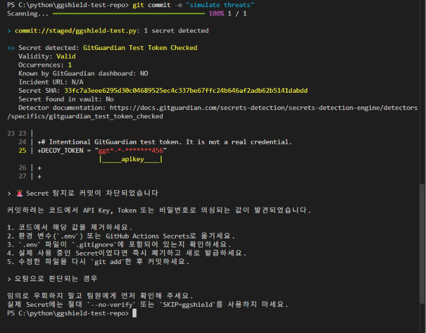

# ggshield pre-commit 차단 테스트

## 개요

`ggshield`는 GitGuardian의 공식 CLI 도구로, 개발자 PC나 CI 환경에서 API 키, 토큰, 비밀번호와 같은 하드코딩된 Secret을 탐지한다. Git의 pre-commit hook과 연결하면 변경사항이 커밋으로 만들어지기 전에 검사하여 Secret이 원격 저장소에 올라가는 것을 예방할 수 있다.

이 저장소에서는 GitGuardian이 탐지기 검증을 위해 제공하는 가짜 테스트 토큰을 사용했다. 실제로 사용할 수 있는 인증정보는 포함하지 않았다.

## 테스트 구성

- 환경: Windows PowerShell
- 도구: `ggshield 1.54.0`
- 적용 위치: 이 저장소의 로컬 pre-commit hook
- 설치 명령: `ggshield install --mode local --hook-type pre-commit`
- 테스트 대상: `ggshield-test.py`
- 테스트 데이터: `ggtt-v-` 형식의 GitGuardian 공식 테스트 토큰

## 차단 과정

1. 안전한 초기 코드를 `main` 브랜치에 커밋했다.
2. `ggshield-test.py`에 GitGuardian 테스트 토큰을 임시로 추가했다.
3. 변경 파일을 `git add`로 staging했다.
4. `git commit -m "simulate threats"`를 실행했다.
5. pre-commit hook이 staged 파일을 `ggshield`로 검사했다.
6. `GitGuardian Test Token Checked` 탐지기가 Secret 1개를 발견했다.
7. `ggshield`가 종료 코드 `1`을 반환하여 Git이 커밋 생성을 중단했다.

## 실행 결과

화면에서 확인할 수 있는 핵심 결과는 다음과 같다.

- 검사 대상: staged 상태의 `ggshield-test.py`
- 탐지 결과: Secret 1개
- 탐지기: `GitGuardian Test Token Checked`
- 유효성 결과: `Valid`
- 최종 결과: 커밋 차단
- 추가 결과: GitGuardian에서 설정한 한국어 remediation 안내문 출력

이 검사는 커밋이 생성되기 전에 수행됐기 때문에 테스트 토큰은 GitHub 원격 저장소에 전송되지 않았다.

## 조치

테스트 완료 후 `ggshield-test.py`에서 가짜 토큰을 제거했다. 실제 Secret이 탐지된 경우에도 코드를 단순히 삭제하는 것에 그치지 않고 다음 조치를 수행해야 한다.

1. 코드에서는 환경 변수나 Secret Manager의 참조만 사용한다.
2. `.env`와 로컬 인증정보 파일은 `.gitignore`에 등록한다.
3. 실제 사용 중인 Secret이었다면 기존 값을 즉시 폐기하고 새로 발급한다.
4. 수정한 파일을 다시 staging한 뒤 커밋한다.

## 공식 문서

- [GitGuardian CLI (`ggshield`) 개요](https://docs.gitguardian.com/ggshield-docs/home)
- [ggshield 시작하기](https://docs.gitguardian.com/ggshield-docs/getting-started)
- [pre-commit 연동](https://docs.gitguardian.com/ggshield-docs/integrations/git-hooks/pre-commit)
- [GitGuardian 테스트 토큰 탐지기](https://docs.gitguardian.com/secrets-detection/secrets-detection-engine/detectors/specifics/gitguardian_test_token_checked)
